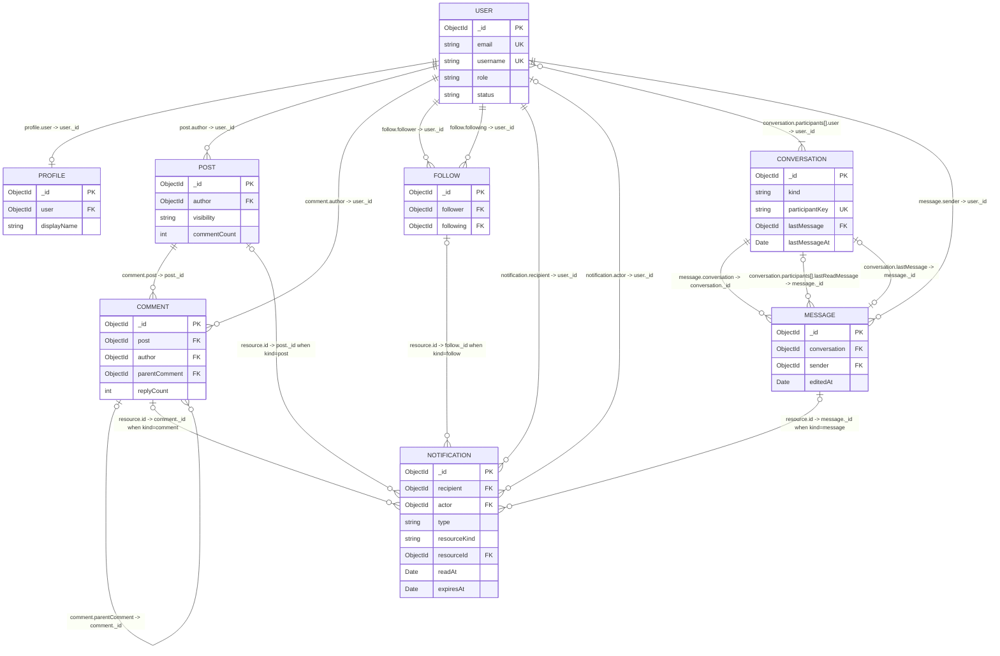

# DevHub entity relationship diagram

This Mermaid ER diagram represents the approved MongoDB collection design. It
documents stored ObjectId reference direction in the relationship labels; it
does not create schemas, models, APIs, or authentication behavior.

## Cardinality and reference notes

Mermaid cardinality markers used here are `||` (exactly one), `o|` (zero or
one), `o{` (zero or many), and `|{` (one or many). Every relationship label is
written as `storedCollection.field -> targetCollection._id` so the reference
direction is unambiguous even though an ER line is visually bidirectional.

| Relationship                          | Cardinality                                          | Stored reference direction                                    | Notes                                                                                      |
| ------------------------------------- | ---------------------------------------------------- | ------------------------------------------------------------- | ------------------------------------------------------------------------------------------ |
| User-Profile                          | one to one                                           | `Profile.user -> User._id`                                    | `Profile.user` is unique, so an account has at most one profile.                           |
| User-Post                             | one to many                                          | `Post.author -> User._id`                                     | A user's posts are unbounded and independently paginated.                                  |
| User-Comment                          | one to many                                          | `Comment.author -> User._id`                                  | A user's comments remain independently owned and moderated.                                |
| Post-Comment                          | one to many                                          | `Comment.post -> Post._id`                                    | A post's discussion can grow without bound.                                                |
| Comment-Comment                       | zero/one parent to zero/many replies                 | `Comment.parentComment -> Comment._id`                        | `parentComment` is nullable for top-level comments.                                        |
| User-Follow                           | one to many in each directed role                    | `Follow.follower -> User._id`; `Follow.following -> User._id` | Follow is a directed join collection with a unique follower/following pair.                |
| User-Notification recipient           | one to many                                          | `Notification.recipient -> User._id`                          | Every notification belongs to one inbox.                                                   |
| User-Notification actor               | zero/one to many                                     | `Notification.actor -> User._id`                              | Nullable for system-generated notifications.                                               |
| Notification-resource                 | zero/one typed target to many                        | `Notification.resource.id -> target._id`                      | The embedded descriptor chooses Post, Comment, Follow, or Message through `resource.kind`. |
| User-Conversation                     | many to many, bounded at two per direct conversation | `Conversation.participants[].user -> User._id`                | Participant state is embedded; there is no ConversationParticipant collection.             |
| Conversation-Message                  | one to many                                          | `Message.conversation -> Conversation._id`                    | Messages are separate because history is unbounded and paginated.                          |
| User-Message                          | one to many                                          | `Message.sender -> User._id`                                  | Captures authorship independently of conversation membership.                              |
| Conversation-participant read Message | zero/one per participant to many                     | `Conversation.participants[].lastReadMessage -> Message._id`  | Embedded participant state records each direct participant's latest read position.         |
| Conversation-latest Message           | zero/one to zero/one                                 | `Conversation.lastMessage -> Message._id`                     | Denormalized pointer used for conversation-list ordering and previews.                     |

## Collection boundaries

The diagram contains eight collections: `users`, `profiles`, `posts`,
`comments`, `follows`, `notifications`, `conversations`, and `messages`.

The following are embedded values, not collections: Profile's bounded profile
sections and media metadata, Post/Message media metadata, Notification's
`resource` descriptor and display data, and Conversation participant/read
state. Their bounded parent-owned lifecycle is why they are not represented as
separate entities.
